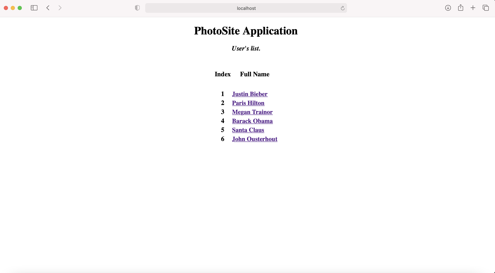
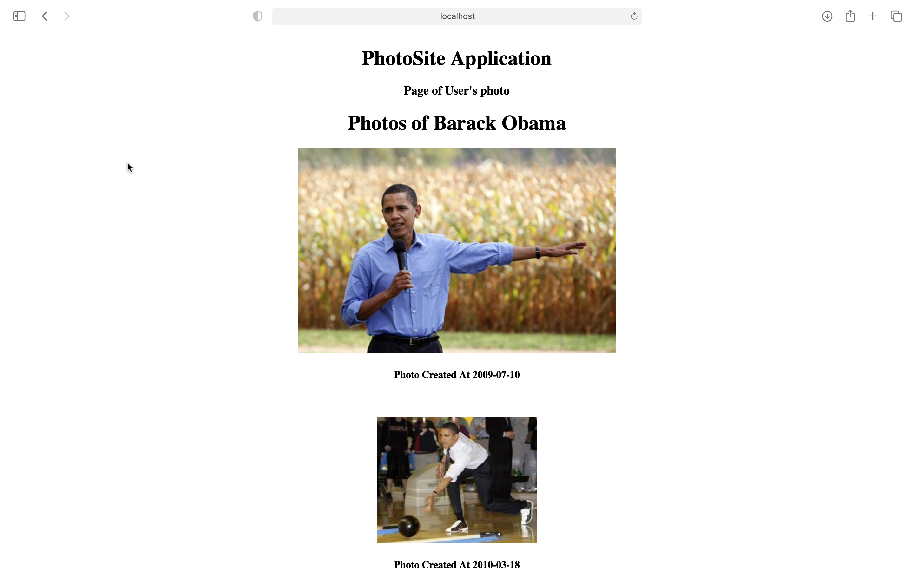
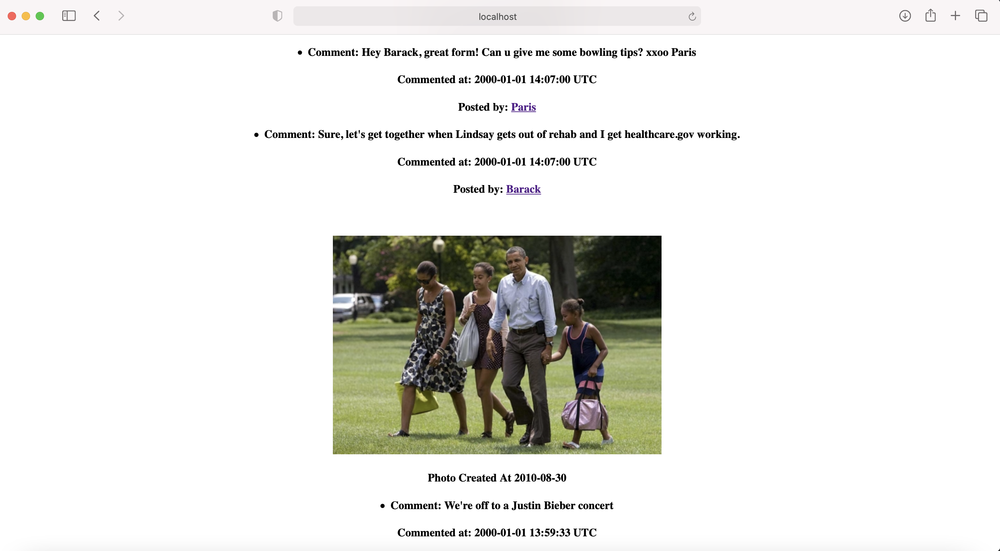
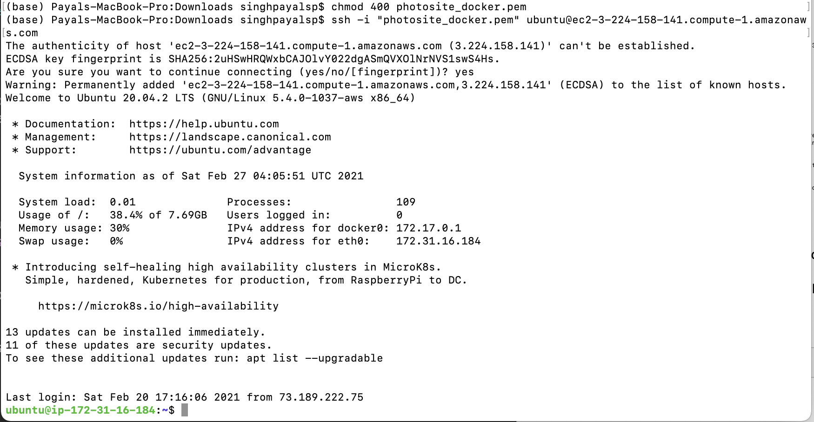
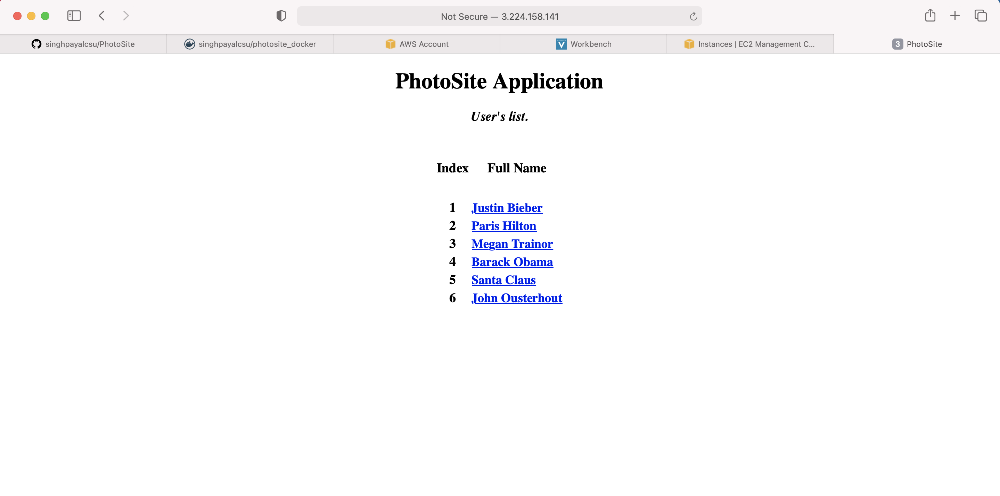
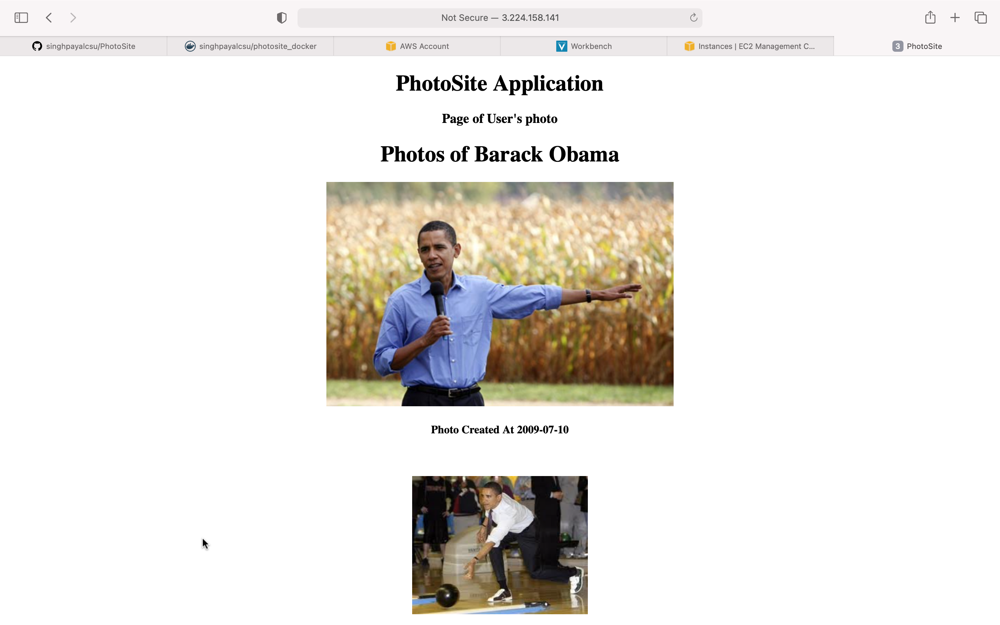
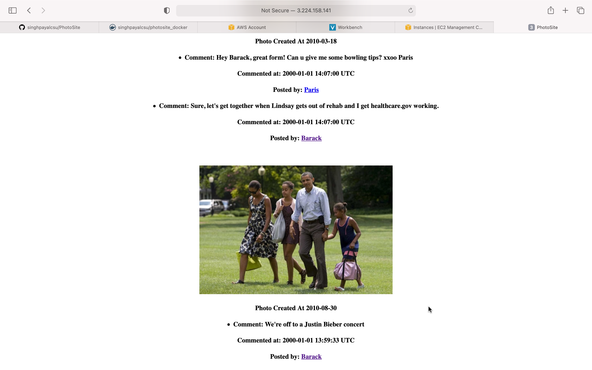
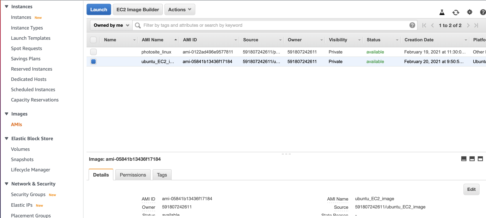
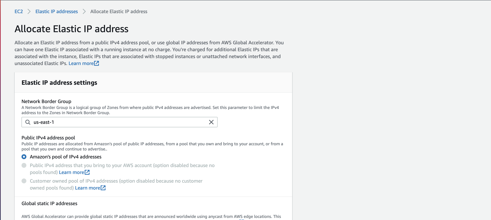

# PhotoSite

### PhotoSite using Ruby Mine IDE
1. Run this Git project using Ruby Mine IDE. This will start server in listening mode.

2. Open "http://localhost:3000/user/index" PhotoSite URL in browser. This shows PhotoSite app's HOME page.
Click on index #4 and it will open new page. This will shows images, comments posted with date & time.

### Docker Image

#### Create a repository in Docker Hub

1. Click on create the repository and Enter the repository name, it's description. 

2. After creating the repository, it will show docker push command for this repository. 

#### Create docker image 

1. Add docker file in Ruby Mine IDE project of PhotoSite.
This file contains ruby version used and different SW like yarn, nodejs, bundle, gem etc installation instruction needed to create docker image.

2. Add docker-compose.yml file in the project.
This file contanis version and rails server port information.

3. Go to PhotoSite folder using Terminal where docker file is present and Run command "docker build -t photosite:docker ." to build and generate docker image with name "photosite" and TAG "docker"

4. Run docker image based PhotoSite app on local laptop
using command "docker run -it -p 3000:3000 photosite: docker". This will start server in listening mode.

5. Open "http://localhost:3000/user/index" PhotoSite URL in browser. This shows PhotoSite app's HOME page.
Click on index #4 and it will open new page. This will shows images, comments posted with date & time.

6. Check docker images created after build using command "docker images"

7. Tag the docker image for upload using command "docker tag photosite:docker singhpayalcsu/photosite_docker" and check the image name after tagging using command "docker images"

8. Upload docker image to docker hub using command "docker push singhpayalcsu/photosite_docker"

9. Login to Docker Hub website and check "photosite_docker" image is availabel 

10. Click on "public view" and it shows docker image pull link "docker pull singhpayalcsu/photosite_docker". Use this command to download docker image

### AWS EC2 

#### AWS EC2 instance creation
1. Open and Login the AWS EC2 url https://console.aws.amazon.com/ec2/

2. Click "Launch Instance"

3. Select "Free tier only" on Left Panel and then select "Ubuntu Server 20.04 LTS (HVM)". You can also select at this point "Amazon Linux 2 AMI (HVM)". After this select "64-bit (x86)" and click "Select".

4. "Choose an Instance Type" as "t2.micro" and click "Configure Instance Details"

5. Let "Configure Instance Details" be default and click "Next:Add Storage"

6. Let "Add Storage" be default with 8 GB and click "Next: Add Tags"

7. Let "Add Tags" be default and click "Next: Configure Security Group"

8. In "Configure Security Group" page create new security group using "Assign a security group" and name "Security group name:".
Add "SSH" Type with source "Anywhere" and then click "Add Rule"
Add "Custom TCP Rule" with source "Anywhere" and Port Range 0.
This is needed to access the PhotoSite link from anywhere once it is deployed on EC2 instance.
Then click "Review and Launch".

9. "Review Instance Launch" the configuration details and click "Launch".
"Create a new pair key" and add "Key pair name" as "photosite_docker" and Download KEY Pair file "photosite_docker.pem". This is "private key file" to connect to EC2 instance securely.

10. After this click "Launch Instances" and this launches new EC2 instance with this configuration

11. Wait for few minutes to allow EC2 instance to move to "Instance state" "Running" and "Status Check" "2/2 checks passed"

12. After this select the instance and click "Connect" and this open "Connect to instance" page with detailed to login EC2 instance and click "SSH Client" Tab for details to access this EC2 instance through Terminal or Putty.

#### AWS EC2 Deployment of PhotoSite app using Docker Image 

##### AWS EC2 instance deployment setup for running on "Ubuntu Server 20.04 LTS (HVM)" - 
1. Open Terminal and go to the folder where "private key file" "photosite_docker.pem" is downloaded or stored. Then Run below command to login to EC2 instance (this command info is from above #12 "SSH Client" Tab)
"chmod 400 photosite_docker.pem" and "ssh -i "photosite_docker.pem" ubuntu@ec2-52-23-171-145.compute-1.amazonaws.com"

2. This provides EC2 instance terminal for deployment of PhotoSite app using Docker Image.

3. Run command below command to install docker utility on EC2 instance.
"sudo apt-get update"

4. "sudo apt-get install     apt-transport-https     ca-certificates     curl     gnupg-agent     software-properties-common"

5. "curl -fsSL https://download.docker.com/linux/ubuntu/gpg | sudo apt-key add -"

6. "sudo apt-key fingerprint 0EBFCD88"

7. " sudo add-apt-repository    "deb [arch=amd64] https://download.docker.com/linux/ubuntu \
   $(lsb_release -cs) \
   stable" "
   
8. "sudo apt-get update"

9. "sudo apt-get install docker-ce docker-ce-cli containerd.io"

10. "apt-cache madison docker-ce"

11. "sudo apt-get install docker-ce=5:20.10.3~3-0~ubuntu-focal docker-ce-cli=5:20.10.3~3-0~ubuntu-focal containerd.io"

##### AWS EC2 instance deployment setup for running on "Amazon Linux 2 AMI (HVM)" -

1. Open Terminal and go to the folder where "private key file" "photosite_docker.pem" is downloaded or stored. Then Run below command to login to EC2 instance (this command info is from above #12 "SSH Client" Tab)
"chmod 400 photosite_docker.pem" and "ssh -i "photosite_docker.pem" ubuntu@ec2-52-23-171-145.compute-1.amazonaws.com"

2. This provides EC2 instance terminal for deployment of PhotoSite app using Docker Image.

3. Run command below command to install docker utility on EC2 instance.

4. " sudo yum update -y "

5. " sudo yum install docker -y "

##### AWS EC2 deploymnet of PhotoSite on both "Ubuntu Server 20.04 LTS (HVM)" and "Amazon Linux 2 AMI (HVM)" -

1. Once above setup for deployment done for "Ubuntu Server 20.04 LTS (HVM)" and "Amazon Linux 2 AMI (HVM)", Run below command

2. To start docker service on EC2 instance 
"sudo yum install docker -y"

3. To install and run docker image of PhotoSite 
"sudo docker run -it -p 3000:3000 singhpayalcsu/photosite"
This will install PhotoSite from Docker Hub if not install and then run the PhotoSite.
This will start PhotoSite server in listening mode.

##### AWS EC2 instance running PhotoSite Access
1. Open "http://52.23.171.145:3000/user/index" PhotoSite URL in browser. This shows PhotoSite app's HOME page.
Click on index #4 and it will open new page. This will shows images, comments posted with date & time.

### AWS EC2 instance's image creation
AWS EC2 instance's image help to create and deploy copy of existing EC2 instance
for load balancing when one instance has fault or under heavy load of traffic.
New EC2 instance creation from AWS EC2 instance's image follow normal flow of Instance creation after Step #4 mentioned below and it already has SW deployed for instance from which image is created & ready to run.

1. Go to EC2 instance, select the EC2 instance.

2. Right click on the Instance and then go to "Image and Templates" and select "Create image".

3. Enter "Image Name" and "Image description" and click create to create image

4. Select "AMIs" in Left Side selection link to view and launch instance of newely created image. To launch EC2 instance creation from images - select image box and click Launch and follow normal EC2 instance creation flow.

### AWS EC2 instance's Elastic IPs
An Elastic IP address is a static IPv4 address designed for dynamic cloud computing. An Elastic IP address is allocated to EC2 instance until it is released. So, anytime EC2 instance is stop and start (until terminated), it can use same IP address for public access.

1. Select the EC2 instance and in Left side selection panel select "Elastic IPs"

2. Select "Allocate Elastic IP address"

3. Select "Amazon's Pool of IPv4 address" 

4. Select "Action" drop down and click "Associate Elastic IP address"

5. Select one of availabel "Private IP address" and check "Allow this Elastic address to be reassociated" and then click "Associate"

6. Check the EC2 instance's "Details" section for "Elastic IP addresses".
Also on Left side selection panel select "Elastic IPs" to see details of Elastic IP address

###### PhotoSite Images taken from - http://borg.csueastbay.edu/~grewe/CS651/ProjectR_AWS_PART1TIPS.html

 

